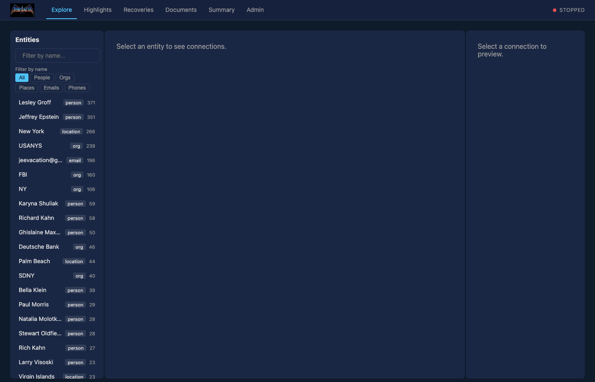
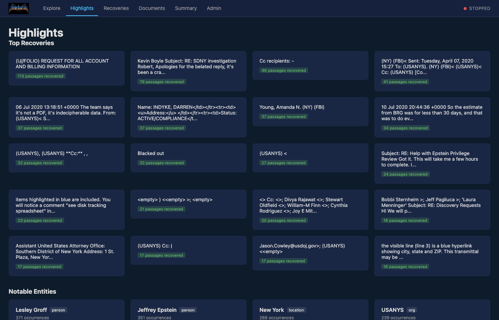
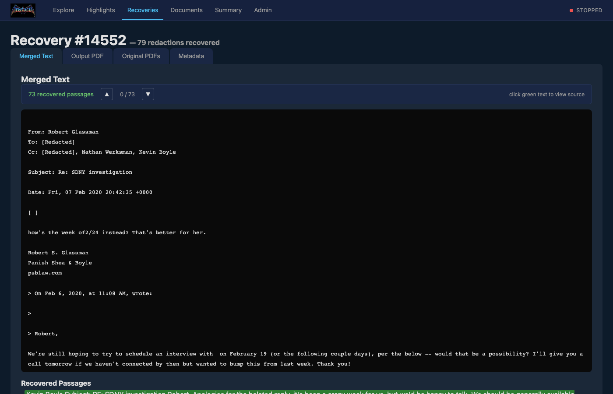
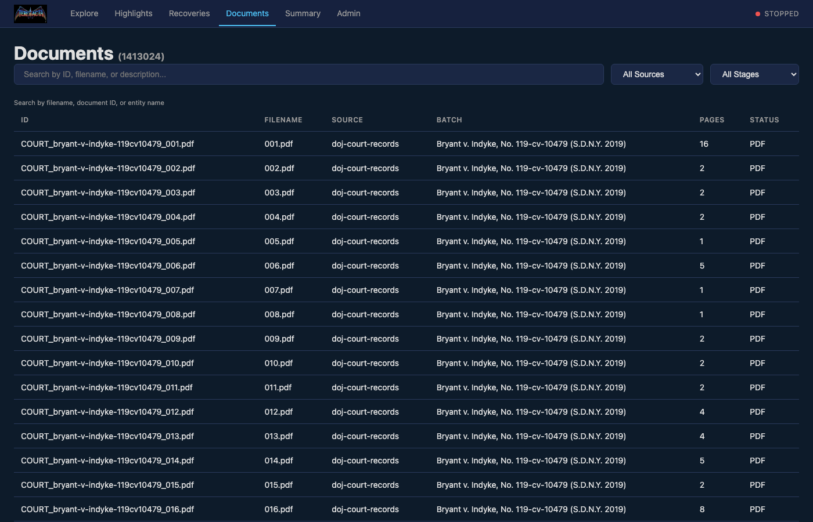

<p align="center">
  
</p>

<p align="center">
  <em>A discovery-first web interface for <a href="https://github.com/networkingguru/Unobfuscator">Unobfuscator</a> — explore recovered redactions, trace entity connections, and investigate government documents.</em>
</p>

---

## Key Findings

TEREDACTA has recovered thousands of redacted passages from the Congressional Epstein/Maxwell document releases. Among them:

- **MCC psychologist email (10 days before Epstein's death):** Internal BOP debate over whether Epstein's first incident was *"a ploy, if someone else did it, or he just gave himself a 'rug burn' with the sheet."* ([Recovery #8022](https://teredacta.counting-to-infinity.com/recoveries/8022?utm_source=github&utm_medium=readme))
- **MCC staff interview list (2 days after Epstein's death):** OIG email mapping staff roles across every shift at MCC on August 9 — which positions covered each shift, which role authored the cellmate memo, which role was notified, and the person flagged as *"potentially in charge of no reassignment."* ([Recovery #2924](https://teredacta.counting-to-infinity.com/recoveries/2924?utm_source=github&utm_medium=readme))
- **FBI evidence log (113 recovered passages):** Extensive case records from the child sex trafficking investigation, including evidence items and seizure inventory from Epstein's safe at 9 East 71st Street. ([Recovery #8848](https://teredacta.counting-to-infinity.com/recoveries/8848?utm_source=github&utm_medium=readme))
- **Maxwell's Vanity Fair damage control:** Ghislaine Maxwell drafting PR responses to a journalist, in her own words: *"I MET HER WHEN SHE WAS 17 AND LIVING WITH HER FIANCE AND AVOID ALL THE OTHER STUFF."* ([Recovery #14414](https://teredacta.counting-to-infinity.com/recoveries/14414?utm_source=github&utm_medium=readme))
- **Missing teenager in flight logs:** SDNY prosecutors discussing a missing Florida teenager in connection with Epstein's flight records. ([Recovery #7726](https://teredacta.counting-to-infinity.com/recoveries/7726?utm_source=github&utm_medium=readme))

### Try It

**[Browse all 5,600+ recovered redactions](https://teredacta.counting-to-infinity.com/highlights?utm_source=github&utm_medium=readme)** from the Congressional Epstein/Maxwell releases.

---

## What It Does

When government agencies release the same documents multiple times with different redaction patterns, [Unobfuscator](https://github.com/networkingguru/Unobfuscator) cross-references the releases and recovers the hidden text. TEREDACTA makes those recoveries explorable through an investigative web interface designed for reporters and researchers.

**Currently deployed against 1.4 million documents from the Congressional Epstein/Maxwell releases** (DOJ volumes, House Oversight releases), with 5,600+ substantive recovered redactions across 15,220 document match groups.

### Key Features

**For Investigators:**
- **Entity Explorer** — Interactive three-column graph showing connections between people, organizations, locations, emails, and phone numbers found in recovered text. Click an entity to see its connections; click a connection to drill deeper.
- **Highlights** — Auto-generated summary of the most significant findings: top recoveries by volume, notable entities, and most frequently recovered strings.
- **Recovery Viewer** — Read recovered redactions with green-highlighted passages, click any passage to see its source document context, navigate between passages with keyboard shortcuts (j/k).
- **Source Panel** — Click a recovered passage to see where it came from: the excerpt from the less-redacted release with the passage highlighted, plus links to the full PDF and document details.
- **Boolean Search** — Search recovered text with AND, OR, and quoted exact phrases. Search documents by filename, ID, or entity name.

**For Administrators:**
- **Pipeline Dashboard** — Live progress, stats, and daemon status via Server-Sent Events.
- **Document Browser** — Paginated, filterable table of all ingested documents.
- **Match Groups** — Explore clusters of overlapping documents with similarity scores.
- **Job Queue** — Monitor pending, running, completed, and failed pipeline jobs.
- **Admin Panel** — Start/stop the daemon, edit config, tail logs, trigger searches, manage dataset downloads, build/rebuild the entity index.

### Screenshots

<p align="center">
  <br>
  <em>Entity Explorer — three-column graph of people, organizations, and documents</em>
</p>

<p align="center">
  <br>
  <em>Highlights — top recoveries and notable entities at a glance</em>
</p>

<p align="center">
  <br>
  <em>Recovery detail — merged text with recovered passages highlighted in green</em>
</p>

<p align="center">
  <br>
  <em>Document browser with search across 1.4 million records</em>
</p>

## Tech Stack

Pure Python. No Node.js, no build step, no JS framework.

| Layer | Choice |
|-------|--------|
| Server | **FastAPI** + **Uvicorn** |
| Reactivity | **HTMX** (vendored) |
| PDF rendering | **PDF.js** (vendored) |
| Live updates | **Server-Sent Events** |
| Templating | **Jinja2** |
| Entity index | **SQLite** (separate from Unobfuscator DB) |
| Auth | Signed cookies + CSRF tokens |
| Database | Read-only SQLite queries against the Unobfuscator DB |

---

## Installation Guide

### Prerequisites

- **Linux server** (Ubuntu 22.04+ recommended) or macOS
- **Python 3.10+**
- **git**
- **~200 GB disk space** for the full dataset (PDF cache + database)

### Step 1: Clone TEREDACTA

```bash
git clone git@github.com:networkingguru/TEREDACTA.git
cd TEREDACTA
```

### Step 2: Create virtualenv and install

```bash
python3 -m venv .venv
source .venv/bin/activate
pip install -e .
```

### Step 3: Run the installer

```bash
python -m teredacta install
```

The installer will:
1. Search for an existing Unobfuscator installation (checks `../Unobfuscator`, `~/Unobfuscator`, `~/Scripts/Unobfuscator`)
2. If not found, offer to clone it from GitHub and set up its virtualenv/dependencies
3. Read Unobfuscator's config to auto-detect database, PDF cache, and output paths
4. Ask for deployment mode (local or server) and port
5. Write config to `./teredacta.yaml` and `~/.teredacta/config.yaml`
6. Offer to start both the Unobfuscator daemon and the TEREDACTA web server

### Step 4: Download datasets

If Unobfuscator doesn't have datasets yet:

```bash
cd ../Unobfuscator
source .venv/bin/activate
python download_datasets.py
```

This downloads the DOJ Epstein disclosure datasets from archive.org mirrors (~200 GB total). Downloads are resumable — if interrupted, re-run the same command.

### Step 5: Start the pipeline

```bash
# Start Unobfuscator (processes documents in the background)
python unobfuscator.py start

# Check status
python unobfuscator.py status
```

The pipeline runs through 5 stages: indexing → fingerprinting/matching → merging → PDF processing → output generation. On first run with all datasets, expect several hours for full processing.

### Step 6: Start TEREDACTA

```bash
cd ../TEREDACTA
source .venv/bin/activate
python -m teredacta run
```

Open [http://localhost:8000](http://localhost:8000). For network access: `python -m teredacta run --host 0.0.0.0`.

### Step 7: Build the entity index

In the browser, go to **Admin → Build / Rebuild** (the Entity Index card). This scans all recovered text and builds the searchable entity graph. Takes 2-10 seconds.

Or wait — if you visit the Explore page before building, it will prompt you.

### Running as a service (Linux)

The installer can generate systemd unit files for both services:

```bash
# During install, choose "server" mode and say yes to systemd
python -m teredacta install

# Or manually:
systemctl --user enable --now unobfuscator
systemctl --user enable --now teredacta
```

---

## Quick Start (if Unobfuscator is already running)

```bash
git clone git@github.com:networkingguru/TEREDACTA.git
cd TEREDACTA
python3 -m venv .venv && source .venv/bin/activate
pip install -e .
python -m teredacta install   # detects existing Unobfuscator
python -m teredacta run
```

---

## Configuration

Config lives at `./teredacta.yaml` or `~/.teredacta/config.yaml`:

```yaml
unobfuscator_path: /path/to/Unobfuscator
unobfuscator_bin: /path/to/Unobfuscator/.venv/bin/python /path/to/Unobfuscator/unobfuscator.py
db_path: /path/to/Unobfuscator/data/unobfuscator.db
pdf_cache_dir: /path/to/Unobfuscator/pdf_cache
output_dir: /path/to/Unobfuscator/output
log_path: /path/to/Unobfuscator/data/unobfuscator.log
host: 127.0.0.1       # 0.0.0.0 for network access, 127.0.0.1 behind reverse proxy
port: 8000
workers: 1             # Uvicorn worker processes (4 recommended for production)
secret_key: <generated-by-installer>  # persist this for stable sessions
log_level: info
```

For server mode (non-localhost), set an admin password:

```bash
export TEREDACTA_ADMIN_PASSWORD=your-password
python -m teredacta run --host 0.0.0.0
```

---

## Architecture

```
Browser ─── Caddy (HTTPS) ─── Uvicorn (N workers) ─┬─ SQLite (read-only, pooled) ── Unobfuscator DB
                                                     ├─ SQLite (read/write, WAL) ──── Entity Index DB
                                                     ├─ SSE (admin only)
                                                     └─ subprocess (admin) ─────────── Unobfuscator CLI
```

FastAPI application with configurable Uvicorn worker processes. Public routes are read-only with pooled SQLite connections. SSE live updates are restricted to admin pages. The entity index is a separate TEREDACTA-owned SQLite database — Unobfuscator's database is never modified.

For production deployment behind a reverse proxy, see [deploy/README.md](deploy/README.md).

---

## Health Monitoring

TEREDACTA includes built-in health endpoints for load balancers, monitoring tools, and stress testing.

### Endpoints

| Endpoint | Purpose | Auth Required |
|---|---|---|
| `GET /health/live` | Liveness probe — is the event loop alive? | No |
| `GET /health/ready` | Readiness probe — can the server handle requests? | No |

**Liveness** returns `{"status": "ok"}` if the process is responsive. Use this for Caddy/load balancer health checks and uptime monitors.

**Readiness** checks DB pool availability and SSE subscriber count, returning `healthy`, `degraded`, or `unhealthy`:

```json
{
  "status": "healthy",
  "worker_pid": 12345,
  "checks": {
    "db_pool": {"status": "ok", "idle": 6, "in_use": 2, "capacity": 8},
    "sse": {"status": "ok", "subscribers": 1},
    "uptime_seconds": 3600.5
  }
}
```

Detailed metrics (pool counts, PID, uptime) are only included for localhost or authenticated admin requests. Public responses return only `{"status": "healthy"}`.

### Thresholds

| Component | Healthy | Degraded | Unhealthy |
|---|---|---|---|
| DB pool (available connections) | ≥3 | 1–2 | 0 |
| SSE subscribers | <20 | 20–100 | >100 |

Thresholds are configurable in `teredacta.yaml`:

```yaml
health_pool_degraded_threshold: 3   # available connections below this = degraded
health_sse_degraded_threshold: 20   # subscribers at or above this = degraded
```

### Caddy Integration

Add health checking to your Caddyfile reverse_proxy block:

```
reverse_proxy localhost:8000 {
    health_uri /health/live
    health_interval 5s
}
```

See [deploy/README.md](deploy/README.md) for the full Caddy setup.

---

## Stress Testing

TEREDACTA includes a comprehensive stress test suite for verifying stability under load. There are two complementary tools:

### Pytest Stress Tests (CI-runnable)

Fast, deterministic tests targeting specific failure modes. These run against an in-process test server with synthetic data — no external server needed.

```bash
# Install dev dependencies (if not already)
pip install -e ".[dev]"

# Run all stress tests
pytest -m stress -v

# Run a specific category
pytest -m stress teredacta/tests/test_stress_db_pool.py -v
pytest -m stress teredacta/tests/test_stress_compound_deadlock.py -v
```

**What's tested:**

| Test File | What It Verifies |
|---|---|
| `test_stress_db_pool.py` | 50 threads competing for 8 connections, recovery after burst, no leaks on timeout |
| `test_stress_sse.py` | 200+ subscribers, abandoned queue cleanup via broadcast eviction, rapid connect/disconnect cycling |
| `test_stress_thread_pool.py` | Health endpoints respond when thread pool executor is fully saturated |
| `test_stress_compound_deadlock.py` | **Production failure mode** — all executor threads blocked on pool.acquire() while event loop remains responsive |
| `test_stress_mixed.py` | Concurrent HTTP requests + SSE + health checks don't deadlock; recovery after load |

Stress tests are excluded from the default `pytest` run (via marker config). They only run when explicitly selected with `-m stress`.

### Locust Load Tests (live server)

Realistic sustained load testing against a running TEREDACTA instance — local or remote.

```bash
# Install locust dependencies
pip install -e ".[stress]"

# Run against local server (uses LoadTestShape: 30s ramp → 4min sustained → 30s cool-down → 15s recovery)
locust -f stress/locustfile.py --headless --host http://localhost:8000

# Run against your VPS
export STRESS_ADMIN_PASSWORD=your-admin-password
locust -f stress/locustfile.py --headless --host https://your-server.com

# Interactive web UI (open http://localhost:8089)
locust -f stress/locustfile.py --host https://your-server.com
```

**Load profile:**

| Phase | Duration | Users |
|---|---|---|
| Warm-up | 0–30s | 0 → 200 |
| Sustained | 30s–4m30s | 200 |
| Cool-down | 4m30s–5m | 200 → 0 |
| Recovery | 5m–5m15s | 1 (health monitor only) |

**User profiles:**

| Profile | Weight | Behavior |
|---|---|---|
| WebUser | 60% | Browses documents, recoveries, highlights, entity explorer |
| SSEUser | 15% | Opens SSE connections (10–60s), mix of graceful/ungraceful disconnects |
| AdminUser | 20% | Dashboard, daemon status, config, logs |
| HealthMonitor | 5% | Polls `/health/live` and `/health/ready`, flags sustained unhealthy status |

**Success criteria:**
- Liveness probe never fails
- Readiness probe does not report "unhealthy" for more than 60 seconds
- Server recovers to "healthy" after load subsides

See [stress/README.md](stress/README.md) for full configuration options.

---

## Troubleshooting

### "Database not found" on startup

TEREDACTA can't find Unobfuscator's database. Check `db_path` in your config:

```bash
cat teredacta.yaml | grep db_path
ls -la /path/shown/above
```

If the file doesn't exist, Unobfuscator hasn't been initialized yet. Run `python unobfuscator.py status` in the Unobfuscator directory.

### "No secret_key found in config file"

This warning means sessions won't survive server restarts. The installer generates a key automatically, but if you created the config manually, add one:

```bash
python3 -c "import os; print('secret_key:', os.urandom(32).hex())" >> teredacta.yaml
```

### Explore page says "Entity index has not been built yet"

Go to **Admin** (top nav) and click **Build / Rebuild** in the Entity Index card. This takes 2-10 seconds.

### PDFs show "not yet downloaded" or "No PDF available"

Two different situations:

- **"PDF not yet downloaded"** — The PDF file exists on the DOJ website but hasn't been cached locally. Run `python download_datasets.py` in the Unobfuscator directory to download datasets.
- **"No PDF available — this is an email record"** — This document was extracted from an email archive (MBOX/EML), not a PDF. The text is available but there's no visual PDF to display. This is normal for datasets 9, 10, and 11 which are primarily email archives.

### "Address already in use" on port 8000

Another process is using the port:

```bash
# Find what's using it
lsof -i :8000

# Kill it, or use a different port
python -m teredacta run --port 8001
```

### Daemon status shows "STOPPED" but Unobfuscator is running

TEREDACTA checks daemon status by reading Unobfuscator's PID file and process list. If Unobfuscator was started from a different directory or user, the check may fail. Verify with:

```bash
cd /path/to/Unobfuscator
source .venv/bin/activate
python unobfuscator.py status
```

### Search returns no results

- **Document search** matches filenames and document IDs as substrings, plus entity names from the entity index. Try shorter search terms.
- **Recovery search** searches the raw recovered text using JSON-encoded matching. Quotes and special characters are handled automatically. Use `AND`, `OR`, or quoted phrases: `"Prince Andrew" AND FBI`.

### Entity index seems incomplete or has wrong entries

The entity index is a rebuildable cache. If results seem off after a pipeline update, rebuild it from **Admin → Entity Index → Build / Rebuild**. The extraction uses regex patterns with a stop list — some false positives are expected for edge cases.

### High memory usage

The Unobfuscator database can be 6+ GB. TEREDACTA opens read-only connections per request and closes them immediately. If memory is a concern, reduce concurrent users or add swap space.

### Permission denied errors

On Linux, ensure the TEREDACTA user can read the Unobfuscator database and PDF cache:

```bash
chmod -R o+r /path/to/Unobfuscator/data/
chmod -R o+r /path/to/Unobfuscator/pdf_cache/
```

---

## License

MIT. See [LICENSE](LICENSE).
