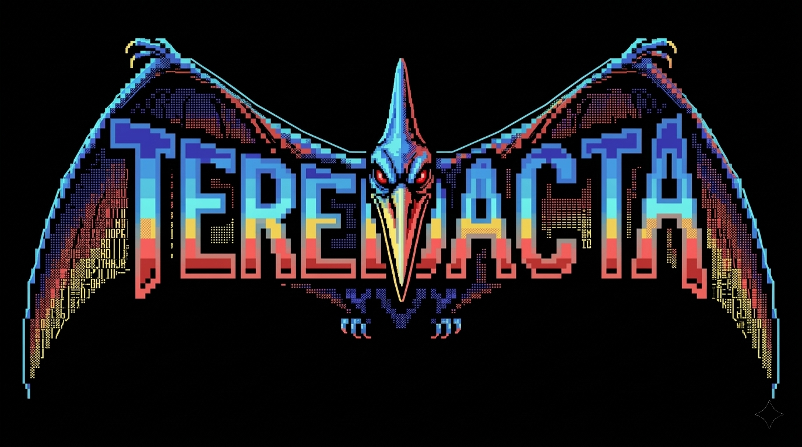

<p align="center">
  
</p>

<p align="center">
  <em>A modern web interface for <a href="https://github.com/Unobfuscator">Unobfuscator</a> — browse documents, view recovered redactions, and monitor your pipeline in real time.</em>
</p>

---

## What It Does

TEREDACTA gives you a single-pane-of-glass view into an [Unobfuscator](https://github.com/Unobfuscator) deployment. Unobfuscator analyzes redacted documents, cross-references overlapping releases, and recovers obscured text. TEREDACTA makes the results explorable through a reactive browser UI with live status updates.

### Features

- **Dashboard** — Live pipeline progress, key stats, and daemon status via Server-Sent Events
- **Document Browser** — Paginated, filterable table of all ingested documents with full-text search
- **Match Groups** — Explore clusters of overlapping documents with similarity scores
- **Recovery Viewer** — Read recovered redactions with green-highlighted passages, source attribution, and side-by-side PDF comparison with synchronized scrolling
- **Top Unredactions** — See the most frequently recovered strings across the entire corpus
- **PDF Viewer** — Embedded PDF.js viewer for originals, outputs, and summary reports
- **Job Queue** — Monitor pending, running, completed, and failed pipeline jobs
- **Admin Panel** — Start/stop the daemon, edit config, tail logs, trigger searches, and manage dataset downloads (password-protected)

## Tech Stack

Pure Python. No Node.js, no build step, no JS framework.

| Layer | Choice |
|-------|--------|
| Server | **FastAPI** + **Uvicorn** |
| Reactivity | **HTMX** (vendored) |
| PDF rendering | **PDF.js** (vendored) |
| Live updates | **Server-Sent Events** |
| Templating | **Jinja2** |
| Auth | Signed cookies + CSRF tokens |
| Database | Read-only SQLite queries against the Unobfuscator DB |
| Dependencies | 7 packages beyond stdlib |

## Getting Started

**Requirements:** Python 3.10+, a configured [Unobfuscator](https://github.com/Unobfuscator) installation.

```bash
pip install -e .

# Guided setup — detects your OS, locates Unobfuscator, writes config
python -m teredacta install

# Start the server
python -m teredacta run
```

Then open [http://localhost:8000](http://localhost:8000).

### Configuration

Config lives at `~/.teredacta/config.yaml` (or `./teredacta.yaml`). Key options:

```yaml
unobfuscator_path: /path/to/Unobfuscator
host: 127.0.0.1      # 0.0.0.0 for network access
port: 8000
log_level: info
```

Set `TEREDACTA_ADMIN_PASSWORD` as an environment variable for admin access in server mode. In local mode (127.0.0.1), admin features are available without a password.

## Architecture

Single FastAPI process with modular routers. Public routes are read-only (direct SQLite with `PRAGMA query_only`). Admin routes invoke the Unobfuscator CLI via subprocess. SSE streams share a single polling task that starts on first client and stops on last disconnect.

```
Browser ─── FastAPI ─┬─ SQLite (read-only) ─── Unobfuscator DB
                     ├─ SSE (live stats)
                     └─ subprocess (admin ops) ─── Unobfuscator CLI
```

## Deployment

- **Local:** `python -m teredacta run` — binds localhost, admin without login
- **Daemon:** `python -m teredacta start` / `stop` (Unix)
- **Docker:** The installer can generate a `docker-compose.yml`
- **systemd:** The installer can generate a unit file (Linux)

## License

Private.
